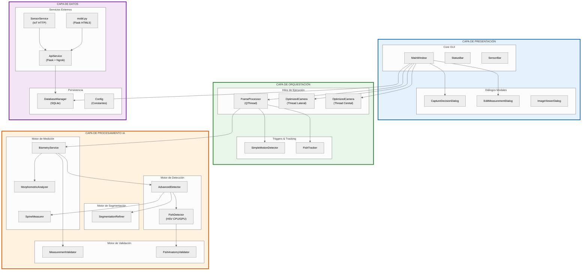

# 🏗️ Diagrama de Arquitectura — FishTracer V1.0

## Diagrama de Arquitectura por Capas (Mermaid)

> **Nota:** Este diagrama usa Mermaid avanzado. Para visualizarlo, use un editor compatible (VS Code con extensión Mermaid, GitHub, draw.io import, etc.)

---

## 1. Diagrama Principal de Arquitectura (Capas + Paralelismo + Decisiones)

```mermaid
%%{init: {'theme': 'base', 'themeVariables': {'primaryColor': '#1a237e', 'primaryTextColor': '#fff', 'primaryBorderColor': '#283593', 'lineColor': '#37474f', 'secondaryColor': '#e8eaf6', 'tertiaryColor': '#f3e5f5', 'fontSize': '14px'}}}%%

flowchart TB

%% ═══════════════════════════════════════════════════════════
%% CAPA 1: HARDWARE & ADQUISICIÓN
%% ═══════════════════════════════════════════════════════════
subgraph HW["<b>⚙️ CAPA 0: HARDWARE</b>"]
    direction LR
    CAM_L["📷 Cámara Lateral<br/>(1080p @ 60fps)"]
    CAM_T["📷 Cámara Cenital<br/>(1080p @ 60fps)"]
    IOT["📡 Sensores IoT<br/>(WOC API)"]
end

%% ═══════════════════════════════════════════════════════════
%% CAPA 2: ADQUISICIÓN PARALELA
%% ═══════════════════════════════════════════════════════════
subgraph ACQ["<b>🔄 CAPA 1: ADQUISICIÓN PARALELA (Threads)</b>"]
    direction LR
    THR_L["🧵 Thread A<br/>OptimizedCamera<br/>(Lateral)"]
    THR_T["🧵 Thread B<br/>OptimizedCamera<br/>(Cenital)"]
    THR_S["🧵 Thread C<br/>SensorService<br/>(Polling 1s)"]
end

%% ═══════════════════════════════════════════════════════════
%% CAPA 3: PRESENTACIÓN
%% ═══════════════════════════════════════════════════════════
subgraph GUI["<b>🖥️ CAPA 2: PRESENTACIÓN (Qt Main Thread)</b>"]
    direction TB
    MW["MainWindow<br/>(Controlador Maestro)"]
    VID["Video Preview<br/>(QTimer 60fps)"]
    SB["StatusBar<br/>+ SensorBar"]
    
    subgraph DIALOGS["Diálogos de Interacción"]
        CDD["CaptureDecisionDialog<br/>⌨️ Esc | M | Enter"]
        EMD["EditMeasurementDialog<br/>✏️ Corrección Manual"]
    end
end

%% ═══════════════════════════════════════════════════════════
%% CAPA 4: ORQUESTACIÓN
%% ═══════════════════════════════════════════════════════════
subgraph ORCH["<b>⚡ CAPA 3: ORQUESTACIÓN (QThread Pipeline)</b>"]
    direction TB
    FP["FrameProcessor<br/>(Worker QThread)"]
    SMD["SimpleMotionDetector<br/>(Estabilidad)"]
    FT["FishTracker<br/>(Suavizado Temporal)"]
end

%% ═══════════════════════════════════════════════════════════
%% CAPA 5: PROCESAMIENTO IA
%% ═══════════════════════════════════════════════════════════
subgraph AI["<b>🧠 CAPA 4: PROCESAMIENTO IA & MEDICIÓN</b>"]
    direction TB
    BS["BiometryService<br/>(Fachada Orquestadora)"]
    
    subgraph DET["Detección (Chain of Responsibility)"]
        direction LR
        AD["AdvancedDetector"]
        FD_API["Fishdream API<br/>(VLM Remoto)"]
        FD_HSV["HSV Fallback<br/>(Local CPU/GPU)"]
    end
    
    subgraph SEG["Segmentación & Medición"]
        direction LR
        SR["SegmentationRefiner<br/>(Contorno Preciso)"]
        GC["GrabCut<br/>(Refinamiento Bordes)"]
        SM["SpineMeasurer<br/>(Esqueleto + B-Spline)"]
    end
    
    subgraph CALC["Cálculo Científico"]
        direction LR
        MA["MorphometricAnalyzer<br/>(Biometría 3D)"]
        MV["MeasurementValidator<br/>(QA/QC)"]
        FAV["FishAnatomyValidator<br/>(Heurísticas)"]
    end
end

%% ═══════════════════════════════════════════════════════════
%% CAPA 6: DATOS Y SERVICIOS
%% ═══════════════════════════════════════════════════════════
subgraph DATA["<b>💾 CAPA 5: DATOS Y SERVICIOS</b>"]
    direction LR
    DB["🗄️ SQLite<br/>(DatabaseManager)"]
    API["🌐 Flask API<br/>(port 5001)"]
    NGROK["☁️ Ngrok Tunnel<br/>(Acceso Público)"]
    MOBILE["📱 Mobile Gateway<br/>(HTML5 + QR)"]
end

%% ═══════════════════════════════════════════════════════════
%% CONEXIONES PRINCIPALES
%% ═══════════════════════════════════════════════════════════

%% Hardware → Threads
CAM_L --> THR_L
CAM_T --> THR_T
IOT --> THR_S

%% Threads → GUI
THR_L --> VID
THR_T --> VID
THR_S --> SB

%% GUI → Orquestación
MW -->|"add_frame()"| FP
VID --> MW

%% Orquestación interna
FP --> SMD
FP --> BS
FP --> FT

%% IA Pipeline
BS --> AD
AD --> FD_API
AD -.->|"fallback"| FD_HSV
BS --> SR
SR --> GC
BS --> SM
BS --> MA
MA --> MV

%% Resultados → GUI
FP -->|"Signal: result_ready"| MW
MW --> CDD
CDD --> EMD

%% Persistencia
MW --> DB
BS --> DB
API --> DB
NGROK --> API
MOBILE --> API
```



---

## 2. Diagrama de Flujo del Pipeline (Decisiones + Bifurcaciones)

```mermaid
%%{init: {'theme': 'base', 'themeVariables': {'primaryColor': '#0d47a1', 'primaryTextColor': '#fff', 'lineColor': '#1565c0', 'fontSize': '13px'}}}%%

flowchart TD

%% ═══════════════════════════════════════════════════════════
%% INICIO Y CAPTURA
%% ═══════════════════════════════════════════════════════════
START(["🚀 INICIO"])
START --> CAPTURE

subgraph CAPTURE["ADQUISICIÓN PARALELA"]
    direction LR
    C1["Thread A:<br/>frame_lateral"]
    C2["Thread B:<br/>frame_cenital"]
end

CAPTURE --> MODE_CHECK

%% ═══════════════════════════════════════════════════════════
%% DECISIÓN: MODO DE OPERACIÓN
%% ═══════════════════════════════════════════════════════════
MODE_CHECK{"¿Modo de<br/>captura?"}
MODE_CHECK -->|"AUTOMÁTICO<br/>(timer continuo)"| STABILITY
MODE_CHECK -->|"SEMIAUTOMÁTICO<br/>(usuario presiona)"| USER_DIALOG

%% ═══════════════════════════════════════════════════════════
%% RAMA AUTOMÁTICA
%% ═══════════════════════════════════════════════════════════
STABILITY{"🔍 ¿Escena<br/>estable?<br/>(SimpleMotionDetector)"}
STABILITY -->|"❌ NO<br/>(motion > threshold)"| WAIT_STABLE["⏳ Esperar...<br/>Reportar motion%"]
WAIT_STABLE --> CAPTURE
STABILITY -->|"✅ SÍ<br/>(N frames estables)"| DETECTION

%% ═══════════════════════════════════════════════════════════
%% RAMA SEMIAUTOMÁTICA
%% ═══════════════════════════════════════════════════════════
USER_DIALOG["CaptureDecisionDialog<br/>🖼️ Vista previa estéreo"]
USER_DIALOG -->|"ESC: Descartar"| CAPTURE
USER_DIALOG -->|"M: Manual"| MANUAL_FORM
USER_DIALOG -->|"ENTER: IA"| DETECTION

MANUAL_FORM["📋 Formulario<br/>Ingreso Manual"]
MANUAL_FORM --> SAVE_DB

%% ═══════════════════════════════════════════════════════════
%% PIPELINE DE DETECCIÓN
%% ═══════════════════════════════════════════════════════════
DETECTION["BiometryService<br/>analyze_and_annotate()"]
DETECTION --> AI_AVAIL

AI_AVAIL{"🤖 ¿Fishdream<br/>disponible?"}
AI_AVAIL -->|"✅ SÍ (API Key válida)"| FISHDREAM
AI_AVAIL -->|"❌ NO (sin red/key)"| HSV_FALLBACK

FISHDREAM["Fishdream API<br/>detect(image, prompt)"]
FISHDREAM --> DET_VALID

HSV_FALLBACK["HSV Chroma Key<br/>(CPU/CUDA local)"]
HSV_FALLBACK --> DET_VALID

%% ═══════════════════════════════════════════════════════════
%% VALIDACIÓN DE DETECCIÓN
%% ═══════════════════════════════════════════════════════════
DET_VALID{"📐 ¿Detección<br/>válida?<br/>(box > MIN_SIZE)"}
DET_VALID -->|"❌ NO"| RETRY["Intentar vista<br/>cenital sola"]
RETRY -->|"Fallo ambas"| DISCARD["⚠️ Descartar frame"]
DISCARD --> CAPTURE
DET_VALID -->|"✅ SÍ"| SEGMENTATION

%% ═══════════════════════════════════════════════════════════
%% SEGMENTACIÓN Y MEDICIÓN
%% ═══════════════════════════════════════════════════════════
SEGMENTATION["SegmentationRefiner<br/>get_body_mask()"]
SEGMENTATION --> GRABCUT["GrabCut<br/>Refinamiento"]
GRABCUT --> SPINE["SpineMeasurer<br/>Esqueleto + B-Spline"]

SPINE --> MORPHO["MorphometricAnalyzer<br/>compute_advanced_metrics()"]
MORPHO --> PHOTOGRAM["Fotogrametría<br/>calcular_escala_proporcional()<br/>(Snell: aire→acrílico→agua)"]
PHOTOGRAM --> FUSION["Fusión de Longitud<br/>(Lateral + Cenital + Spine)"]

%% ═══════════════════════════════════════════════════════════
%% VALIDACIÓN QA/QC
%% ═══════════════════════════════════════════════════════════
FUSION --> QAQC

QAQC{"🔬 ¿Medición<br/>válida (QA/QC)?<br/>• Rango 4-50cm<br/>• Factor K ok<br/>• Peso coherente<br/>• Geometría ok"}
QAQC -->|"❌ WARNINGS"| WARNINGS["⚠️ Registrar<br/>advertencias"]
WARNINGS --> TRACKER
QAQC -->|"✅ LIMPIO"| TRACKER

%% ═══════════════════════════════════════════════════════════
%% SUAVIZADO TEMPORAL
%% ═══════════════════════════════════════════════════════════
TRACKER["FishTracker<br/>Suavizado Temporal<br/>(promedio ponderado)"]
TRACKER --> TEMP_STABLE

TEMP_STABLE{"📊 ¿Temporalmente<br/>estable?<br/>(CV < 10%, N≥5 frames)"}
TEMP_STABLE -->|"❌ NO<br/>(acumulando)"| CAPTURE
TEMP_STABLE -->|"✅ SÍ"| FINAL_CHECK

%% ═══════════════════════════════════════════════════════════
%% DECISIÓN FINAL (auto vs semi)
%% ═══════════════════════════════════════════════════════════
FINAL_CHECK{"¿Modo?"}
FINAL_CHECK -->|"Automático"| AUTO_DELAY["⏱️ Delay 17s<br/>+ Confirmación"]
FINAL_CHECK -->|"Semiautomático"| USER_ACCEPT

USER_ACCEPT{"👤 ¿Usuario<br/>acepta resultado?"}
USER_ACCEPT -->|"✅ Aceptar"| SAVE_DB
USER_ACCEPT -->|"✏️ Editar"| EDIT_DIALOG["EditMeasurement<br/>Dialog"]
EDIT_DIALOG --> SAVE_DB

AUTO_DELAY --> SAVE_DB

%% ═══════════════════════════════════════════════════════════
%% PERSISTENCIA
%% ═══════════════════════════════════════════════════════════
SAVE_DB[("💾 SQLite<br/>DatabaseManager<br/>+ Imagen Collage<br/>+ Datos IoT")]
SAVE_DB --> API_SYNC["🌐 API Flask<br/>Disponible vía Ngrok"]
SAVE_DB --> CAPTURE

%% ═══════════════════════════════════════════════════════════
%% ESTILOS
%% ═══════════════════════════════════════════════════════════
classDef decision fill:#fff3e0,stroke:#e65100,stroke-width:2px,color:#000
classDef process fill:#e3f2fd,stroke:#1565c0,stroke-width:1px,color:#000
classDef parallel fill:#e8f5e9,stroke:#2e7d32,stroke-width:2px,color:#000
classDef data fill:#f3e5f5,stroke:#6a1b9a,stroke-width:2px,color:#000
classDef error fill:#ffebee,stroke:#c62828,stroke-width:1px,color:#000
classDef user fill:#fff8e1,stroke:#f57f17,stroke-width:2px,color:#000

class STABILITY,AI_AVAIL,DET_VALID,QAQC,TEMP_STABLE,USER_ACCEPT,MODE_CHECK,FINAL_CHECK decision
class DETECTION,SEGMENTATION,GRABCUT,SPINE,MORPHO,PHOTOGRAM,FUSION,TRACKER process
class CAPTURE,C1,C2 parallel
class SAVE_DB,API_SYNC data
class DISCARD,RETRY error
class USER_DIALOG,MANUAL_FORM,EDIT_DIALOG user
```



---

## 3. Diagrama de Componentes (Estilo IEEE/UML)



---

## 4. Código para draw.io (XML)

El siguiente XML puede importarse directamente en [draw.io](https://app.diagrams.net/) para obtener un diagrama editable profesional:

> **Instrucciones:** Abra draw.io → Archivo → Importar → Pegar el XML a continuación.

```xml
<mxfile host="app.diagrams.net">
  <diagram name="FishTracer Architecture" id="arch-main">
    <mxGraphModel dx="1422" dy="794" grid="1" gridSize="10" guides="1" tooltips="1" connect="1" arrows="1" fold="1" page="1" pageScale="1" pageWidth="1600" pageHeight="1200">
      <root>
        <mxCell id="0" />
        <mxCell id="1" parent="0" />
        
        <!-- CAPA 0: HARDWARE -->
        <mxCell id="layer0" value="⚙️ CAPA 0: HARDWARE" style="swimlane;horizontal=1;startSize=30;fillColor=#f5f5f5;strokeColor=#666666;fontStyle=1;fontSize=14;" vertex="1" parent="1">
          <mxGeometry x="50" y="20" width="1500" height="80" as="geometry" />
        </mxCell>
        <mxCell id="cam_l" value="📷 Cámara Lateral&#xa;(1080p@60fps)" style="rounded=1;whiteSpace=wrap;fillColor=#dcedc8;strokeColor=#689f38;" vertex="1" parent="layer0">
          <mxGeometry x="100" y="35" width="160" height="40" as="geometry" />
        </mxCell>
        <mxCell id="cam_t" value="📷 Cámara Cenital&#xa;(1080p@60fps)" style="rounded=1;whiteSpace=wrap;fillColor=#dcedc8;strokeColor=#689f38;" vertex="1" parent="layer0">
          <mxGeometry x="320" y="35" width="160" height="40" as="geometry" />
        </mxCell>
        <mxCell id="iot" value="📡 Sensores IoT&#xa;(WOC API)" style="rounded=1;whiteSpace=wrap;fillColor=#fff9c4;strokeColor=#f9a825;" vertex="1" parent="layer0">
          <mxGeometry x="540" y="35" width="160" height="40" as="geometry" />
        </mxCell>

        <!-- CAPA 1: ADQUISICIÓN -->
        <mxCell id="layer1" value="🔄 CAPA 1: ADQUISICIÓN PARALELA (Independent Threads)" style="swimlane;horizontal=1;startSize=30;fillColor=#e8f5e9;strokeColor=#2e7d32;fontStyle=1;fontSize=14;" vertex="1" parent="1">
          <mxGeometry x="50" y="120" width="1500" height="80" as="geometry" />
        </mxCell>
        <mxCell id="thr_l" value="🧵 Thread A: OptimizedCamera (Lateral)" style="rounded=1;whiteSpace=wrap;fillColor=#c8e6c9;strokeColor=#388e3c;" vertex="1" parent="layer1">
          <mxGeometry x="80" y="35" width="280" height="35" as="geometry" />
        </mxCell>
        <mxCell id="thr_t" value="🧵 Thread B: OptimizedCamera (Cenital)" style="rounded=1;whiteSpace=wrap;fillColor=#c8e6c9;strokeColor=#388e3c;" vertex="1" parent="layer1">
          <mxGeometry x="400" y="35" width="280" height="35" as="geometry" />
        </mxCell>
        <mxCell id="thr_s" value="🧵 Thread C: SensorService (Polling)" style="rounded=1;whiteSpace=wrap;fillColor=#fff9c4;strokeColor=#f9a825;" vertex="1" parent="layer1">
          <mxGeometry x="720" y="35" width="260" height="35" as="geometry" />
        </mxCell>

        <!-- CAPA 2: GUI -->
        <mxCell id="layer2" value="🖥️ CAPA 2: PRESENTACIÓN (Qt Main Thread)" style="swimlane;horizontal=1;startSize=30;fillColor=#e3f2fd;strokeColor=#1565c0;fontStyle=1;fontSize=14;" vertex="1" parent="1">
          <mxGeometry x="50" y="220" width="1500" height="120" as="geometry" />
        </mxCell>
        <mxCell id="mw" value="MainWindow&#xa;(Controlador Maestro)" style="rounded=1;whiteSpace=wrap;fillColor=#bbdefb;strokeColor=#1565c0;fontStyle=1;" vertex="1" parent="layer2">
          <mxGeometry x="100" y="40" width="200" height="50" as="geometry" />
        </mxCell>
        <mxCell id="vid" value="Video Preview&#xa;(QTimer)" style="rounded=1;whiteSpace=wrap;fillColor=#bbdefb;strokeColor=#1565c0;" vertex="1" parent="layer2">
          <mxGeometry x="340" y="40" width="140" height="50" as="geometry" />
        </mxCell>
        <mxCell id="cdd" value="CaptureDecision&#xa;Dialog" style="rounded=1;whiteSpace=wrap;fillColor=#fff9c4;strokeColor=#f9a825;" vertex="1" parent="layer2">
          <mxGeometry x="520" y="40" width="140" height="50" as="geometry" />
        </mxCell>
        <mxCell id="emd" value="EditMeasurement&#xa;Dialog" style="rounded=1;whiteSpace=wrap;fillColor=#fff9c4;strokeColor=#f9a825;" vertex="1" parent="layer2">
          <mxGeometry x="700" y="40" width="140" height="50" as="geometry" />
        </mxCell>
        <mxCell id="sb" value="StatusBar + SensorBar" style="rounded=1;whiteSpace=wrap;fillColor=#bbdefb;strokeColor=#1565c0;" vertex="1" parent="layer2">
          <mxGeometry x="880" y="40" width="180" height="50" as="geometry" />
        </mxCell>

        <!-- CAPA 3: ORQUESTACIÓN -->
        <mxCell id="layer3" value="⚡ CAPA 3: ORQUESTACIÓN (QThread Pipeline)" style="swimlane;horizontal=1;startSize=30;fillColor=#e0f7fa;strokeColor=#00838f;fontStyle=1;fontSize=14;" vertex="1" parent="1">
          <mxGeometry x="50" y="360" width="1500" height="100" as="geometry" />
        </mxCell>
        <mxCell id="fp" value="FrameProcessor&#xa;(Worker QThread)" style="rounded=1;whiteSpace=wrap;fillColor=#b2ebf2;strokeColor=#00838f;fontStyle=1;" vertex="1" parent="layer3">
          <mxGeometry x="100" y="40" width="200" height="45" as="geometry" />
        </mxCell>
        <mxCell id="smd" value="SimpleMotionDetector&#xa;(Estabilidad)" style="rhombus;whiteSpace=wrap;fillColor=#fff3e0;strokeColor=#e65100;" vertex="1" parent="layer3">
          <mxGeometry x="380" y="30" width="180" height="60" as="geometry" />
        </mxCell>
        <mxCell id="ft" value="FishTracker&#xa;(Suavizado Temporal)" style="rounded=1;whiteSpace=wrap;fillColor=#b2ebf2;strokeColor=#00838f;" vertex="1" parent="layer3">
          <mxGeometry x="620" y="40" width="180" height="45" as="geometry" />
        </mxCell>

        <!-- CAPA 4: IA -->
        <mxCell id="layer4" value="🧠 CAPA 4: PROCESAMIENTO IA &amp; MEDICIÓN" style="swimlane;horizontal=1;startSize=30;fillColor=#fff3e0;strokeColor=#e65100;fontStyle=1;fontSize=14;" vertex="1" parent="1">
          <mxGeometry x="50" y="480" width="1500" height="200" as="geometry" />
        </mxCell>
        <mxCell id="bs" value="BiometryService&#xa;(Fachada)" style="rounded=1;whiteSpace=wrap;fillColor=#ffe0b2;strokeColor=#e65100;fontStyle=1;" vertex="1" parent="layer4">
          <mxGeometry x="50" y="40" width="160" height="45" as="geometry" />
        </mxCell>
        <mxCell id="ad" value="AdvancedDetector&#xa;(Chain of Responsibility)" style="rounded=1;whiteSpace=wrap;fillColor=#ffe0b2;strokeColor=#e65100;" vertex="1" parent="layer4">
          <mxGeometry x="260" y="40" width="200" height="45" as="geometry" />
        </mxCell>
        <mxCell id="fd_api" value="Fishdream API&#xa;(VLM Remoto)" style="rounded=1;whiteSpace=wrap;fillColor=#c8e6c9;strokeColor=#2e7d32;" vertex="1" parent="layer4">
          <mxGeometry x="260" y="110" width="140" height="40" as="geometry" />
        </mxCell>
        <mxCell id="fd_hsv" value="HSV Fallback&#xa;(Local CPU/GPU)" style="rounded=1;whiteSpace=wrap;fillColor=#ffcdd2;strokeColor=#c62828;" vertex="1" parent="layer4">
          <mxGeometry x="420" y="110" width="140" height="40" as="geometry" />
        </mxCell>
        <mxCell id="sr" value="SegmentationRefiner&#xa;(Contorno)" style="rounded=1;whiteSpace=wrap;fillColor=#ffe0b2;strokeColor=#e65100;" vertex="1" parent="layer4">
          <mxGeometry x="600" y="40" width="160" height="45" as="geometry" />
        </mxCell>
        <mxCell id="sm_node" value="SpineMeasurer&#xa;(Esqueleto+Spline)" style="rounded=1;whiteSpace=wrap;fillColor=#ffe0b2;strokeColor=#e65100;" vertex="1" parent="layer4">
          <mxGeometry x="800" y="40" width="160" height="45" as="geometry" />
        </mxCell>
        <mxCell id="ma" value="MorphometricAnalyzer&#xa;(Cálculo 3D)" style="rounded=1;whiteSpace=wrap;fillColor=#ffe0b2;strokeColor=#e65100;" vertex="1" parent="layer4">
          <mxGeometry x="1000" y="40" width="180" height="45" as="geometry" />
        </mxCell>
        <mxCell id="mv" value="MeasurementValidator&#xa;(QA/QC)" style="rhombus;whiteSpace=wrap;fillColor=#fff9c4;strokeColor=#f9a825;" vertex="1" parent="layer4">
          <mxGeometry x="1000" y="110" width="180" height="60" as="geometry" />
        </mxCell>

        <!-- CAPA 5: DATOS -->
        <mxCell id="layer5" value="💾 CAPA 5: DATOS Y SERVICIOS EXTERNOS" style="swimlane;horizontal=1;startSize=30;fillColor=#f3e5f5;strokeColor=#6a1b9a;fontStyle=1;fontSize=14;" vertex="1" parent="1">
          <mxGeometry x="50" y="700" width="1500" height="90" as="geometry" />
        </mxCell>
        <mxCell id="db" value="🗄️ SQLite&#xa;(DatabaseManager)" style="shape=cylinder3;whiteSpace=wrap;fillColor=#ce93d8;strokeColor=#6a1b9a;" vertex="1" parent="layer5">
          <mxGeometry x="100" y="35" width="160" height="45" as="geometry" />
        </mxCell>
        <mxCell id="api" value="🌐 Flask API&#xa;(port 5001)" style="rounded=1;whiteSpace=wrap;fillColor=#e1bee7;strokeColor=#6a1b9a;" vertex="1" parent="layer5">
          <mxGeometry x="320" y="35" width="140" height="45" as="geometry" />
        </mxCell>
        <mxCell id="ngrok" value="☁️ Ngrok&#xa;(Tunnel Público)" style="rounded=1;whiteSpace=wrap;fillColor=#e1bee7;strokeColor=#6a1b9a;" vertex="1" parent="layer5">
          <mxGeometry x="500" y="35" width="140" height="45" as="geometry" />
        </mxCell>
        <mxCell id="mobile" value="📱 Mobile&#xa;(HTML5 + QR)" style="rounded=1;whiteSpace=wrap;fillColor=#e1bee7;strokeColor=#6a1b9a;" vertex="1" parent="layer5">
          <mxGeometry x="680" y="35" width="140" height="45" as="geometry" />
        </mxCell>
        <mxCell id="config" value="⚙️ Config&#xa;(Constantes)" style="rounded=1;whiteSpace=wrap;fillColor=#e1bee7;strokeColor=#6a1b9a;" vertex="1" parent="layer5">
          <mxGeometry x="860" y="35" width="140" height="45" as="geometry" />
        </mxCell>

        <!-- FLECHAS PRINCIPALES -->
        <mxCell id="e1" style="edgeStyle=orthogonalEdgeStyle;" edge="1" parent="1" source="cam_l" target="thr_l">
          <mxGeometry relative="1" as="geometry" />
        </mxCell>
        <mxCell id="e2" style="edgeStyle=orthogonalEdgeStyle;" edge="1" parent="1" source="cam_t" target="thr_t">
          <mxGeometry relative="1" as="geometry" />
        </mxCell>
        <mxCell id="e3" style="edgeStyle=orthogonalEdgeStyle;" edge="1" parent="1" source="iot" target="thr_s">
          <mxGeometry relative="1" as="geometry" />
        </mxCell>
      </root>
    </mxGraphModel>
  </diagram>
</mxfile>
```

---

## 5. Descripción Estructurada para Dibujo Manual (IEEE Style)

### Nodos por Capa

#### CAPA 0 — Hardware
| ID | Forma | Texto | Color |
|----|-------|-------|-------|
| HW-1 | Rectángulo | Cámara Lateral (1080p) | Verde claro |
| HW-2 | Rectángulo | Cámara Cenital (1080p) | Verde claro |
| HW-3 | Rectángulo | Sensores IoT (WOC) | Amarillo |

#### CAPA 1 — Adquisición Paralela
| ID | Forma | Texto | Color |
|----|-------|-------|-------|
| ACQ-1 | Cilindro | Thread A: OptimizedCamera (Lat) | Verde |
| ACQ-2 | Cilindro | Thread B: OptimizedCamera (Top) | Verde |
| ACQ-3 | Cilindro | Thread C: SensorService | Amarillo |

#### CAPA 2 — Presentación
| ID | Forma | Texto | Color |
|----|-------|-------|-------|
| GUI-1 | Rectángulo doble borde | MainWindow (Controlador) | Azul |
| GUI-2 | Rectángulo | Video Preview (QTimer) | Azul claro |
| GUI-3 | Rombo | CaptureDecisionDialog | Naranja |
| GUI-4 | Rectángulo | EditMeasurementDialog | Naranja |
| GUI-5 | Rectángulo | StatusBar + SensorBar | Azul claro |

#### CAPA 3 — Orquestación
| ID | Forma | Texto | Color |
|----|-------|-------|-------|
| ORC-1 | Rectángulo bold | FrameProcessor (QThread) | Cian |
| ORC-2 | Rombo | SimpleMotionDetector: ¿Estable? | Naranja |
| ORC-3 | Rectángulo | FishTracker (Suavizado) | Cian |

#### CAPA 4 — Procesamiento IA
| ID | Forma | Texto | Color |
|----|-------|-------|-------|
| AI-1 | Rectángulo bold | BiometryService (Fachada) | Naranja |
| AI-2 | Rectángulo | AdvancedDetector (Chain) | Naranja |
| AI-3 | Rectángulo | Fishdream API (remoto) | Verde |
| AI-4 | Rectángulo | HSV Fallback (local) | Rojo claro |
| AI-5 | Rectángulo | SegmentationRefiner | Naranja |
| AI-6 | Rectángulo | SpineMeasurer (Esqueleto) | Naranja |
| AI-7 | Rectángulo | MorphometricAnalyzer (3D) | Naranja |
| AI-8 | Rombo | MeasurementValidator: ¿QA/QC? | Amarillo |

#### CAPA 5 — Datos
| ID | Forma | Texto | Color |
|----|-------|-------|-------|
| DAT-1 | Cilindro | SQLite (DatabaseManager) | Púrpura |
| DAT-2 | Rectángulo | Flask API (5001) | Lila |
| DAT-3 | Nube | Ngrok (Tunnel) | Lila |
| DAT-4 | Rectángulo | Mobile Gateway (QR) | Lila |

### Conexiones Principales
| Origen | Destino | Tipo | Etiqueta |
|--------|---------|------|----------|
| HW-1 | ACQ-1 | Sólida | VideoCapture |
| HW-2 | ACQ-2 | Sólida | VideoCapture |
| HW-3 | ACQ-3 | Sólida | HTTP GET |
| ACQ-1 | GUI-2 | Sólida | frame_lateral |
| ACQ-2 | GUI-2 | Sólida | frame_cenital |
| GUI-1 | ORC-1 | Sólida | add_frame() |
| ORC-1 | ORC-2 | Sólida | ¿Estable? |
| ORC-2 | AI-1 | Sólida (Sí) | Procesar |
| AI-1 | AI-2 | Sólida | detect() |
| AI-2 | AI-3 | Sólida | Intento 1 |
| AI-2 | AI-4 | Punteada | Fallback |
| AI-1 | AI-5 | Sólida | segment() |
| AI-5 | AI-6 | Sólida | mask → spine |
| AI-1 | AI-7 | Sólida | compute() |
| AI-7 | AI-8 | Sólida | validate() |
| AI-8 | ORC-3 | Sólida (OK) | metrics |
| ORC-3 | GUI-1 | Sólida | Signal: result_ready |
| GUI-1 | DAT-1 | Sólida | save() |
| DAT-2 | DAT-1 | Sólida | query() |
| DAT-3 | DAT-2 | Sólida | tunnel |

### Decisiones Clave (Rombos)
| Decisión | Condición YES | Condición NO |
|----------|---------------|--------------|
| ¿Escena estable? | motion < threshold × N frames | Esperar, reintentar |
| ¿Fishdream disponible? | API key válida + red OK | HSV Fallback local |
| ¿Detección válida? | box > MIN_SIZE | Descartar frame |
| ¿QA/QC pasa? | Rangos biológicos OK | Registrar warnings |
| ¿Temporalmente estable? | CV < 10%, N ≥ 5 | Acumular más datos |
| ¿Usuario acepta? (semi) | Confirma resultado | Editar manualmente |

---

*Diagrama IEEE-style para el sistema FishTracer V1.0 — Universidad de Cundinamarca, LESTOMA.*
